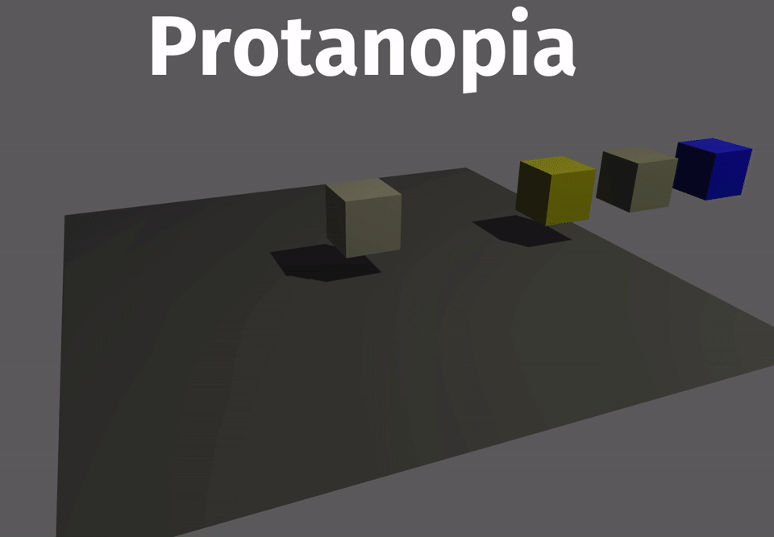

<div align="center">

# Bevy Color Blindness Simulation

[](https://crates.io/crates/bevy_color_blindness)
[](https://docs.rs/bevy_color_blindness)



</div>

[Bevy](https://docs.rs/bevy) plugin to simulate and preview different types of
Color Blindness.

This lets you ensure that your game is accessible to all players by testing how it will be seen under different conditions.
While this is important, please also consider not relying on color alone to convey important information to your players.
A common option is to add identifying symbols, like in the game [Hue](https://gameaccessibilityguidelines.com/hue-colorblind-mode/).

Based on [Alan Zucconi's post](https://www.alanzucconi.com/2015/12/16/color-blindness/). Supports: Normal, Protanopia, Protanomaly, Deuteranopia, Deuteranomaly, Tritanopia, Tritanomaly, Achromatopsia, and Achromatomaly.

## Using

First, add the following to your `Cargo.toml`:

```toml
bevy_color_blindness = "0.2.0"
```

Then, add the `ColorBlindnessPlugin` to your app, and add `ColorBlindnessCamera` to
your main camera.

```rust
use bevy::prelude::*;
use bevy_color_blindness::*;

fn main() {
    App::new()
        .add_plugins(DefaultPlugins)
        // add the plugin
        .add_plugin(ColorBlindnessPlugin)
        .add_startup_system(setup)
        .run();
}

fn setup(mut commands: Commands) {
    // set up your scene...

    // create the camera
    commands
        .spawn_bundle(Camera3dBundle {
            transform: Transform::from_xyz(-2.0, 2.5, 5.0).looking_at(Vec3::ZERO, Vec3::Y),
            ..Default::default()
        })
        .insert(ColorBlindnessCamera {
            mode: ColorBlindnessMode::Deuteranopia,
            enabled: true,
        });
}
```

## Important note

This plugin only simulates how color blind players will see your game.
It does not correct for color blindness to make your game more accessible.
This plugin should only be used during development, and removed on final builds.
